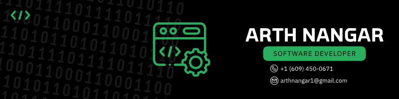

  

<h1 align="center"> Hi 👋, I'm Arth Nangar </h1>
<h3 align="center">A passionate Software Developer</h3>

 **💫 About Me:**

  - 🎓 I am Graduate Student of Computer Science at New Jersey Institute of Technology.
  - 🎓 Completed my Undergrad from Dharmsinh Desai University, Nadiad.
  - 🤔 I'm looking at **AI-ML**
  - 📫 How to reach me **arthnangar3@gmail.com**
  - Check out my Portfolio : **https://arthnangarportfolio.vercel.app/**

<h3 align="left">Connect with me:</h3>

 

# ⚡ Tech Stack:

### 🚀 Languages

<table align="center">
  <tr>
    <td align="center" width="90">
      
       C
    </td>
    <td align="center" width="90">
      
       C ++
    </td>
    <td align="center" width="90">
      
       CSS
    </td>
    <td align="center" width="90">
      
       HTML
    </td>
<td align="center" width="90">
      
       Java
    </td>
<td align="center" width="90">
      
       JavaScript
    </td>
    <td align="center" width="90">
      
       Python
    </td>
    
  </tr>
</table>

### 💻 Libraries & Framework
<table align="center">
   <td align="center" width="90">
    
     React
    </td>
    <td align="center" width="90">
      
       tailwind
    </td>
    <td align="center" width="90">
      
       Expressjs
    </td>
     <td align="center" width="90">
      
       Bootstrap
    </td>
    <td align="center" width="90">
      
       NextJs
    </td>
    <td align="center" width="90">
      
       NodeJs
    </td>
  
</table>

### 🧑🏻‍💻 Tools & Platform

<table align="center">
  <tr>
     <td align="center" width="90">
      
       Aws
    </td>
     <td align="center" width="90">
      
       Github
    </td>
    <td align="center" width="90">
      
       Vercel
    </td>
    <td align="center" width="90">
      
       MongoDB
    </td>
     <td align="center" width="90">
      
       Mysql
    </td>
    <td align="center" width="90">
      
       Postgres
    </td>
    </tr>
  <tr>
    <td align="center" width="90">
      
       Postman 
    </td>
    <td align="center" width="90">
      
       Vscode
    </td>
    <td align="center" width="90">
      
       NodeJs
    </td>
    <td align="center" width="90">
      
       Intellij Idea
    </td>
        <td align="center" width="90">
      
       Android Studio
    </td>
      <td align="center" width="90">
      
       Git Bash
    </td>
    </tr>
</table>
